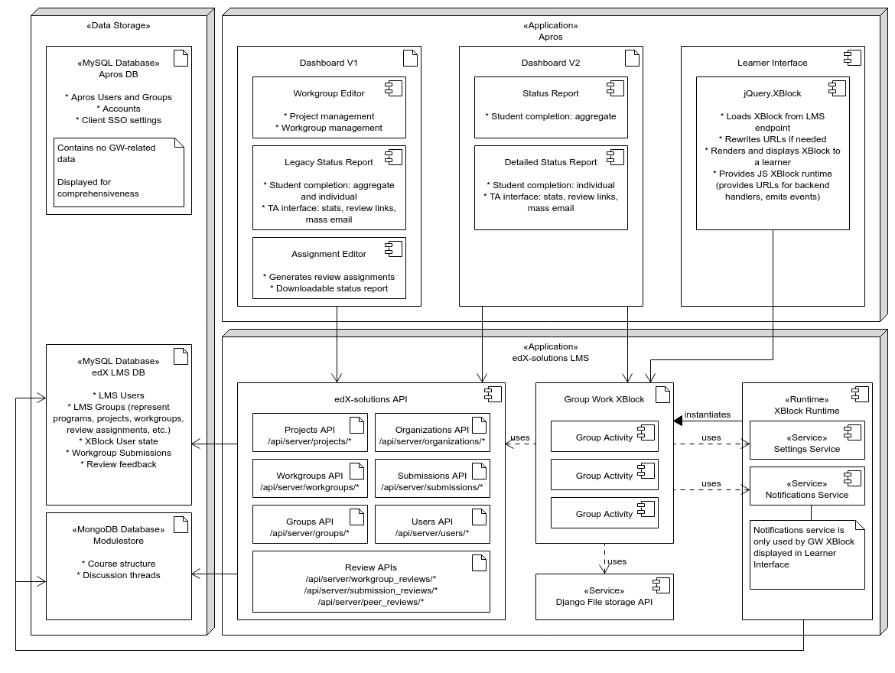
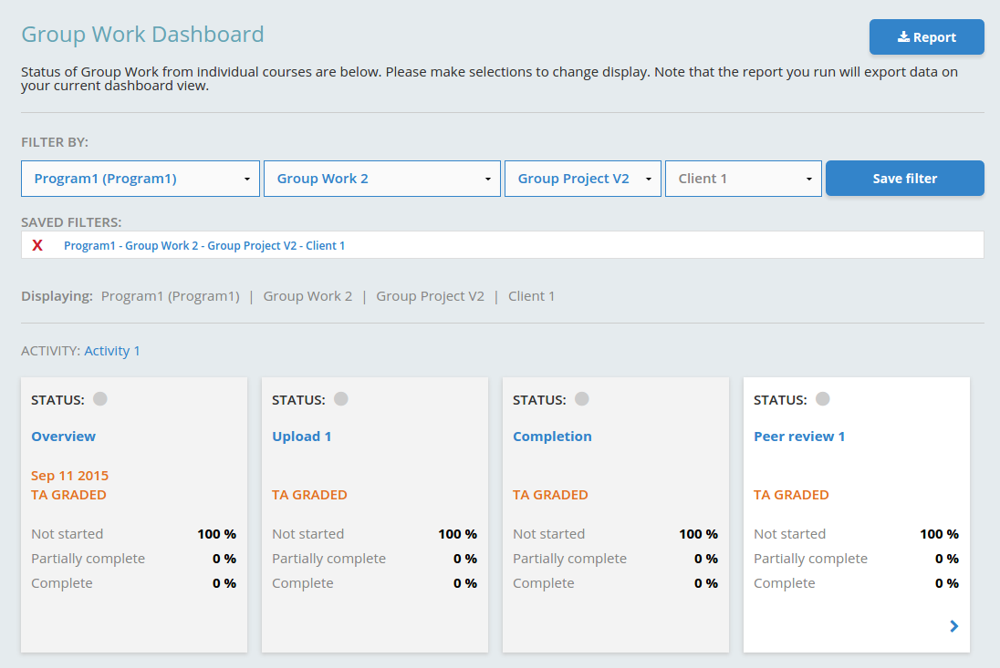
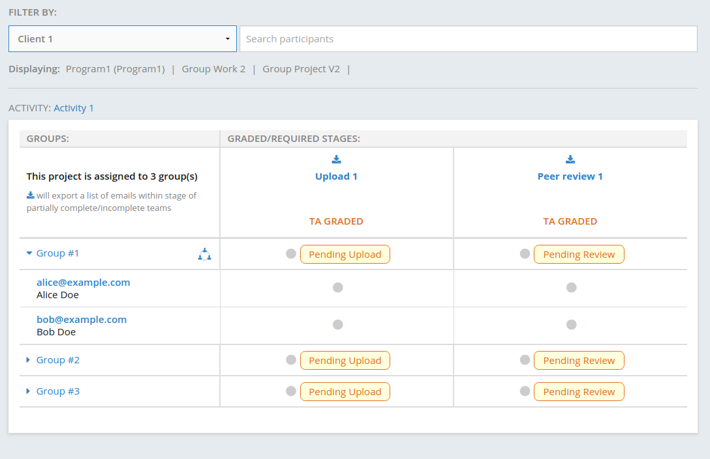

# Overall schema

GWv2 admin dashboard V2 contains two components: overview and detailed view. Both are partially implemented in Apros 
(filter and search) and the rest of it comes from GWv2 XBlock itself; jQuery.xblock is used to glue the 
two parts together.

# Glossary

There’s some ambiguity in the terms used when one talks about group project exercises. 
In order to avoid confusion, the following conventions are used throughout this document and are suggested 
to be ubiquitously adopted:

* *Group Work v2 XBlock* or *GWv2 XBlock* - the XBlock that provides group project functionality, or an instance of 
  that XBlock.
* *Group Project* or *GP* or *Project* - an entity representing single group project exercise. 
  Associated with particular GWv2 XBlock instance in a particular course. Workgroups, and review assignments are 
  associated with the Group Project directly.

**Other relevant terms:**

* *Program* - a collection of courses
* *Course* - a collection of learning materials (lectures, texts, videos, problems, etc.) grouped into a logically 
  bound unit.
* *Workgroup* - a group of students that work together on a group project exercise. 
  Also, a data structure to represent that group in a program. Workgroups are associated with particular Group Project. 
  Students might belong to different Workgroups in different courses.
* *TA* (stands for teaching assistant) - a role that grants ability (and responsibility) of assisting learners 
  through the course. In context of GP, TAs fulfill two responsibilities: grading submissions (if submission is 
  configured to be TA-graded) and providing review feedback to learners (if such feature is added to a GP). 
  Also, a user having that role.
* *Review Assignment* - an association between some learner and some workgroup; the learner can not be a member of 
  that workgroup; the learner is responsible for reviewing that workgroup’s submissions. 
  Also, an object that represents this association in the program.

# GWv2 admin dashboard configuration

One of the design goals for GWv2 was the ability to run it on vanilla edX platform. It was known that this goal 
can not be pursued in scope of original GWv2 project, since GWv2 heavily depends on edX-solutions API, 
which is not found in the vanilla platform. Nevertheless, that goal influenced some design decisions; one of those 
decisions is to extract Apros-specific and access control settings into configuration variables.

GWv2 XBlock uses [SettingsService][settings-service] (exists in vanilla platform) to obtain configuration variables 
from the LMS django settings. Details on what settings GWv2 expect to find and their meaning can be found in 
[GWv2 XBlock deployment documentation](deployment.md#setting-configuration-variables).

[settings-service]: https://github.com/edx/edx-platform/blob/76b8e2e89761c30ac7aa2fa5e8aca4dc35d9002b/common/lib/xmodule/xmodule/services.py#L7

# Overview

Overview provides aggregate completion stats across all the workgroups and presents the report to TA/internal admins 
in a concise fashion.

* Filters (Program, Course, Project, Client) are implemented in Apros.
* Saved filters are stored in Apros DB.
* Program, Course and Project filters are sequential and are used to select a single GWv2 instance. 
* Client filter is used to further restrict selection options and also to filter out workgroups from other companies. 
  Client filter selection is passed to the LMS XBlock rendering endpoint via query string parameter, and then passed to 
  GWv2 XBlock as part of its rendering context.
* When Project filter is applied, jQuery.xblock is used to load GWv2 XBlock custom view (dashboard_view).
* GWv2 XBlock has hierarchical internal structure: it consists of multiple Group Work Activities, each of which 
  consists of multiple Group Work Stages; both Activities and Stages are represented as XBlocks. Dashboard_view 
  recursively renders the corresponding view at each level.
* **Note:** links to detail views are generated by GWv2 XBlock, but must point to an Apros URL. 
  For this approach to work, GWv2 XBlock uses configurable setting for the “details view” URL; 
  actual configuration contains Apros-specific template.
Details view

Details view provides insight into each workgroup and individual student progress. From this view, 
TAs can interact with learners by sending emails (to individual learners or to workgroups), 
download group submissions for evaluation or help and jump in to provide reviews.

* Filter and search are implemented in Apros.
* Company filter value is passed to GWv2 XBlock the same way as in Overview: as a query string parameter to the 
  LMS rendering endpoint and then as part of the rendering context to the GWv2 XBlock itself.
* Search is completely client-side - no data is sent to server. However, the implementation is split between 
  Apros page (that contains the search and filter) and GWv2 JS file: Apros emits events 
  (`group_project_v2.details_view.search` and `group_project_v2.details_view.search_clear`) when search clause is ready,
  GWv2 JS code does actual search and highlighting.
* **Note:** TA review links are generated by GWv2 XBlock, but must point to an Apros URL. 
  For this approach to work, GWv2 XBlock uses configurable setting for “TA review” URL; actual configuration contains 
  Apros-specific template.

# edX Solutions LMS API endpoints

Dependencies from GWv2 itself are listed in [GWv2 deployment document](/docs/deployment.md#api-dependencies) - the list 
contains all the endpoints used by GWv2 XBlock both in dashboard views and in learner interface. 
The majority of endpoints are used in both though.

Additional dependencies from apros:

* /api/server/groups - list of LMS groups. Groups are used to represent multiple GP-related entities: 
  Programs, Workgroups, Review Assignments, etc.
* /api/server/groups/:id - group details (Program/Review Assignment, Workgroup, etc.)
* /api/server/groups/:id/courses - lists Courses in a Program.
* /api/server/courses - list of all Courses (filtered most of the time)
* /api/server/courses/:id - course details - course start and end date, grading, course structure, etc.
* /api/server/courses/:id/users - students enrolled in a Course.
* /api/server/courses/:id/projects - Group Projects in a Course.
* /api/server/courses/:id/completions - data about completed problems in the course.
* /api/server/users/preferences - student preferences
* /api/server/users/:id/organizations - lists Organizations for user (access control check)
* /api/server/projects?course_id=...&content_id=... - lists Group Projects

Note some endpoints are used both by GWv2 and Apros (i.e. /api/server/projects endpoint).

# EdX-solutions and Apros dependencies

The GWv2 XBlock uses some features and components not found in vanilla edX-platform:

* edX Solutions API - see above for details.
* Apros styles - in particular “reveal-modal” popup styles. Overall, the visual appearance of GWv2 is tailored to 
  look as close to Apros as possible; some of these will not look nice on vanilla platform.
* While vanilla edX-platform provides (unpublished) [API for rendering custom XBlock views][xblock-view-endpoint], this API is not used in 
  other parts of LMS in any way. GWv2 XBlock uses custom views extensively, but most of those views are only used 
  “internally” - called from some standard view and results are embedded into standard view response. 
  However, both dashboard view (Overview and Detail View aka dashboard_view and dashborad_details_view) are 
  expected to be called externally. The LMS will need to be updated in some way to allow using those views.
* GWv2 XBlock does not provide any means to configure Group Project (Workgroups, Review Assignments, etc.); 
  such configuration is performed from Apros

[xblock-view-endpoint]: https://github.com/edx/edx-platform/blob/cc65094/lms/urls.py#L299-L309