# Authoring

Group Project XBlock v2 relies heavily on "nested XBlocks". In other words, a Group Project is built from several
XBlocks that work together, each implementing a small subset of the overall Group project functionality: peer grading,
submissions upload, team discussions, etc. Most of these features are implemented with XBlocks that are unique to the
Group Project XBlock v2 package, but some more advanced features reuse other XBlocks from the Open edX ecosystem.

An example of a Group Project containing two activities:

* Group Project XBlock
    * Group Activity XBlock 1
        * Stage XBlock 1
        * Stage XBlock 2
            * Stage component XBlock
            * Stage component XBlock
        * Stage XBlock 3
    * Group Activity XBlock 2
        * Stage XBlock 4
            * Stage Component XBlock
        * Stage XBlock 5
    * Project Navigator XBlock
        * Project Navigation View Xblock
        * Submissions View XBlock
        * Resources View XBlock
        * Private Discussion View XBlock
    * Discussion XBlock

A typical Group Project contains several activities, each of which has multiple stages. In addition to that, the
"Project Navigator" is a required component; if it is omitted, the Group Project XBlock will display validation errors
in Studio and will display an error message in the LMS. Also, Navigation View is a required component of Project
Navigator. Thus, each Group Project XBlock must always contain at least Project Navigator with Navigation View in it.

Activities act as larger chunks of group project by combining stages into logically bound units. Grading
happens at the activity level.

Each stage represents single group project step - getting acquainted with the team, familiarizing with the task,
uploading deliverable, providing and receiving grading, etc. Stages themselves are usually built from multiple stage
components - which range from simple HTML blocks to more sophisticated Project Team and Submission blocks. Also, by
using Resource blocks, a stage can provide various resources to the student: grading rubrics, submission templates, or
any other relevant documents and videos.

In the example above, a Group Project with two activities, the Project Navigator and Private Discussions are shown.
Activity 1 is composed of three stages, and Activity 2 is composed of two stages. Some stages have stage components -
even smaller building blocks, varied by stage type. The Project Navigator shown in this example has four nested
XBlocks, which represent most of the child blocks that can be enabled within the Project Navigator.

Available stages and their intended use:

* `Text` - simple stage showing some author-defined text.
* `Completion` - almost the same as `Text`, except it requires student to explicitly mark this stage as completed. Use
     for simple non-graded tasks, i.e. "Get acquainted with the team", "Read related chapters in course textbook", etc.
* `Submission` - at this stage students are asked to upload their deliverables. Most of the actual group project work is
   likely to happen during this stage. Use to set up a list of deliverables for an activity and a deadline to upload
   them. If deliverable templates are provided to students, the best place to place them is in a stage of this type.
* `Team Evaluation` - allows students to provide anonymous feedback to teammates. Intended use is to allow students
    in the team to provide and receive feedback about their team work, role in the team, communication skills, etc.
* `Peer Grading` - this stage, in addition to the `Submission` stage, forms a backbone of group project. During this stage
    deliverables uploaded earlier are graded by either students in other groups or by Teaching Assistants. The grading
    criteria can be delivered to students as contents of this stage or resources on this stage.
* `Evaluation Display` - this stage allows students to review feedback from their teammates. Use with `Team Evaluation` stage.
* `Grade Display` - this stage allows students to review their group grade and feedback received from graders. Use with
    `Peer Grading` stage.

For more information, see [the detailed list of available XBlocks](XBlocks.md).

Group Project XBlock v2 uses standard Studio editing capabilities:

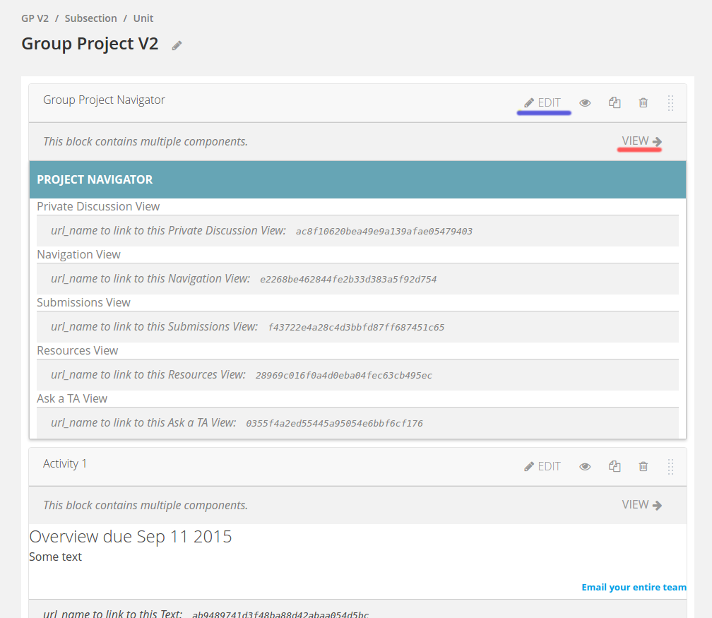

* The Edit button (blue outline) is used to edit XBlock settings, i.e. "Display name", "Open Date", "Close Date", etc.
* The View button (red outline) allows to "jump into" an XBlock and view its nested XBlocks, allowing to add,
    configure, reorder and delete them.

This screenshot shows the same Group Project Navigator XBlock "from the inside", displaying Project Navigator Views
added to the navigator.

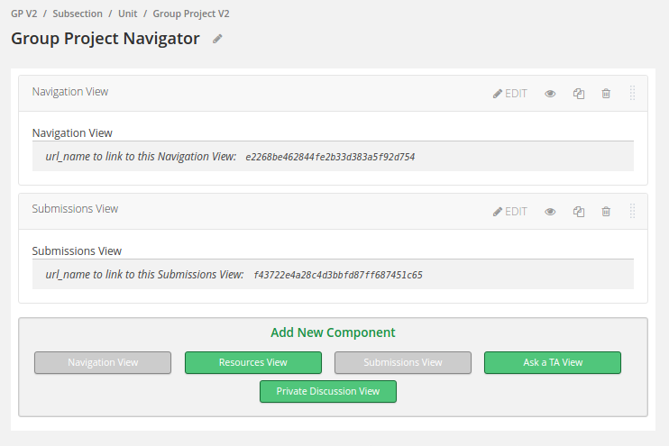

## Group Project Authoring Walkthrough

In this section, we will show, step-by-step, how to create a group project, and how the finished project appears to
learners and course-team members.  The project we create will contain two activities, comprising one peer-graded, and
one graded by course TAs.

First, we need to add `"gp-v2-project"` to the Advanced Module List under `Settings > Advanced Settings`.  **Do not**
enable `"group-project"`; that module is deprecated and no longer maintained.

Though studio does not require it, by convention a Group Project is usually placed in its own chapter, subsection, and
vertical.  When rendered in Apros, this will appear outside the normal flow of the course, so we will create them as
the last chapter of a course.

Inside this vertical, where prompted to "Add New Component," we will select Advanced > gp-v2-project, as shown below:

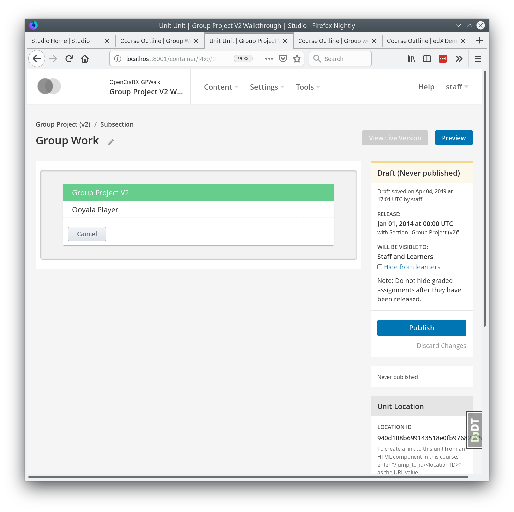

When the module is first created, it will display a warning that says "This component has validation issues."  This is
expected.  Once we have filled out the structure of the Group Project module, the warning will go away.

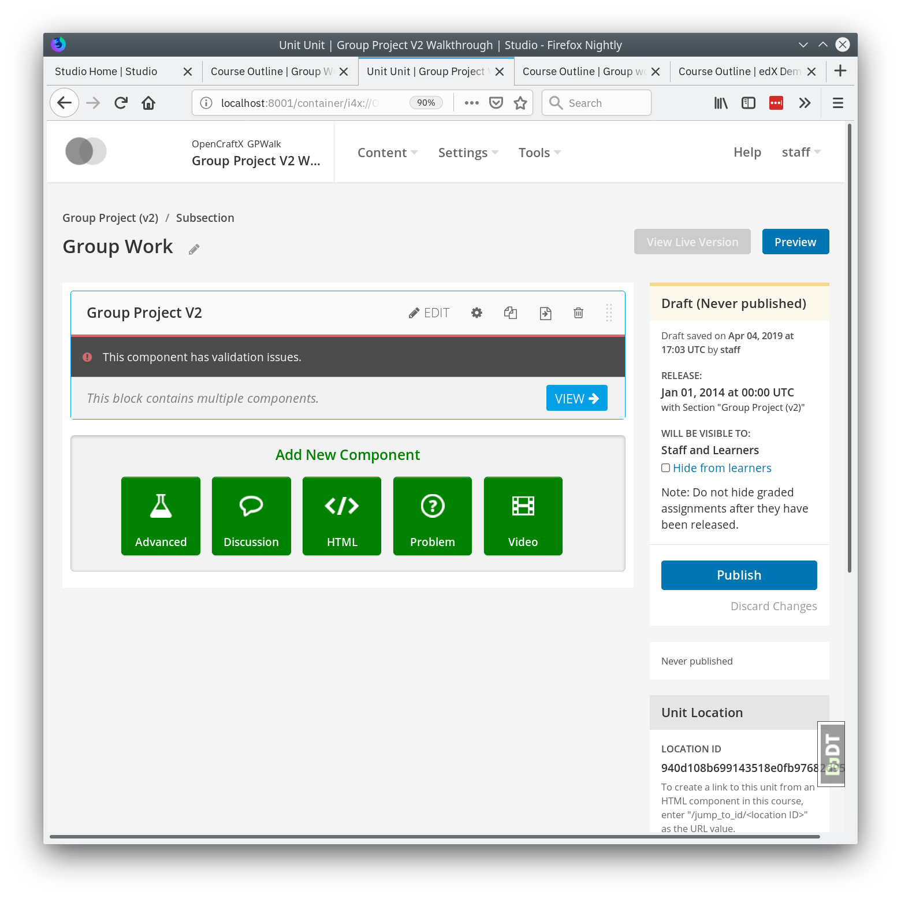

The first thing we will do is give our module a name: Select "Edit" on the "Group Project V2" line, and change the
display name to "Walkthrough Project", and click save.

Next select `View ->`, to begin adding components to our Group Project.  We will first add a Group Project Navigator,
then an activity, and finally, a section for class discussions

### Creating the Group Project Navigator

Here we see more details about the validation problems mentioned earlier:
"Group Project must contain Project Navigator Block."

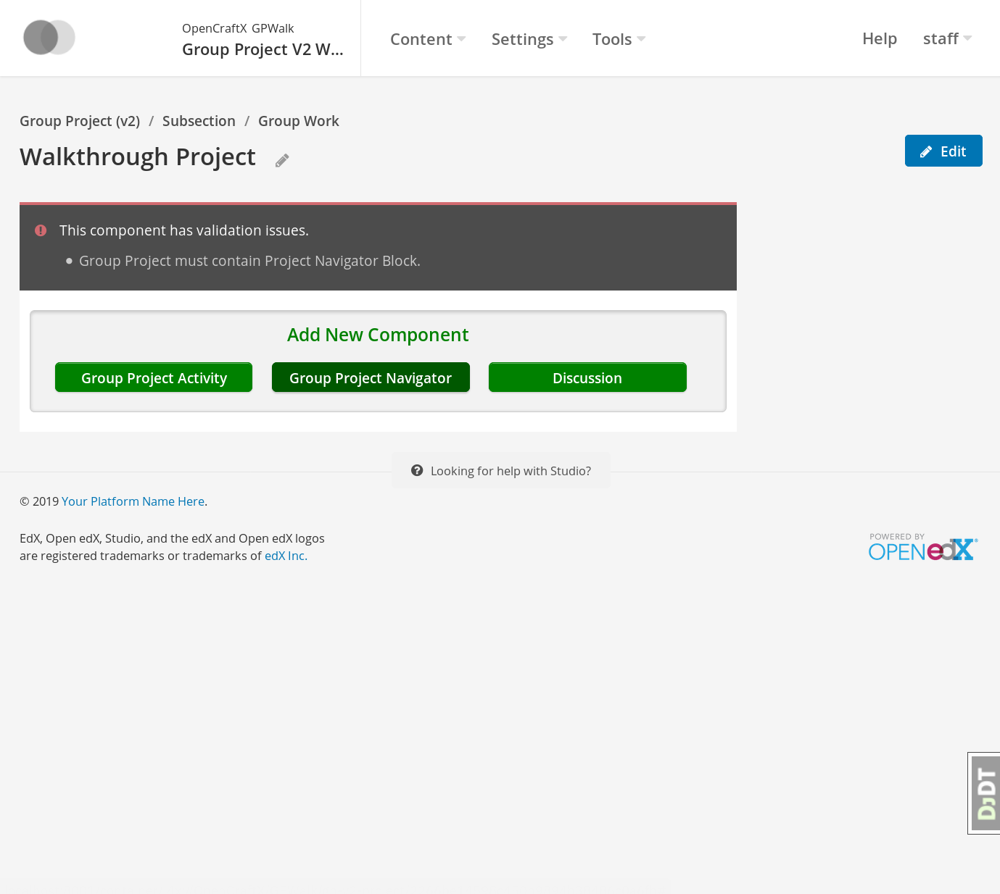

So let's resolve that now, by adding a new "Group Project Navigator" component.  elect the button of that name from the
"Add New Component" section, then click `View ->` to add content to the navigation section.  Here we are given several
options.  We must add a "Navigation View" to the "Group Project Navigator."  Note that you may need to refresh the page
to resolve the validation error.  This will be the case on several of the pages that follow.  Now we will also add the
other four available components:  The "Resources View" will allow learners to see downloadable content we provide for
them.  "Submissions View" will let them see activities that they have submitted.  Finally, the "Ask a TA View" and
"Private Discussion View" components will give learners a place to interact with their course staff and with each other
respectively.  The "Private Discussion View" now has a validation issue, but this will be resolved later.

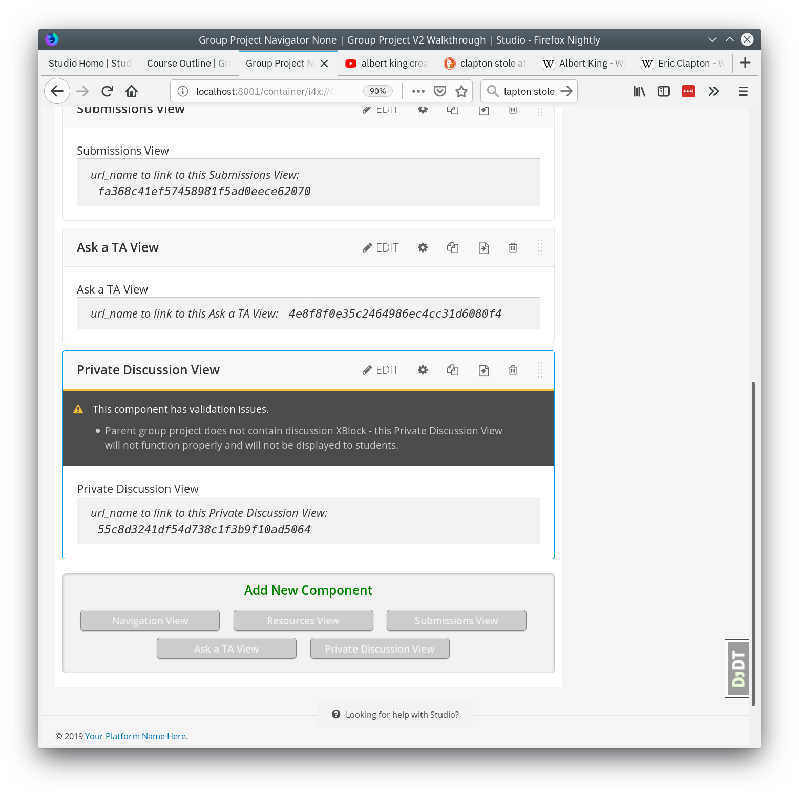

That concludes our setup of the navigation section.  Now we will add some content to the group project.

### Adding an activity.

The Group Project v2 system allows authors to organize student work into distinct activities, each of which can have
one or more stages required to complete the activity.

To get started, select the "Group Project Activity" button under "Add New Component.  The screen will now look like
this:

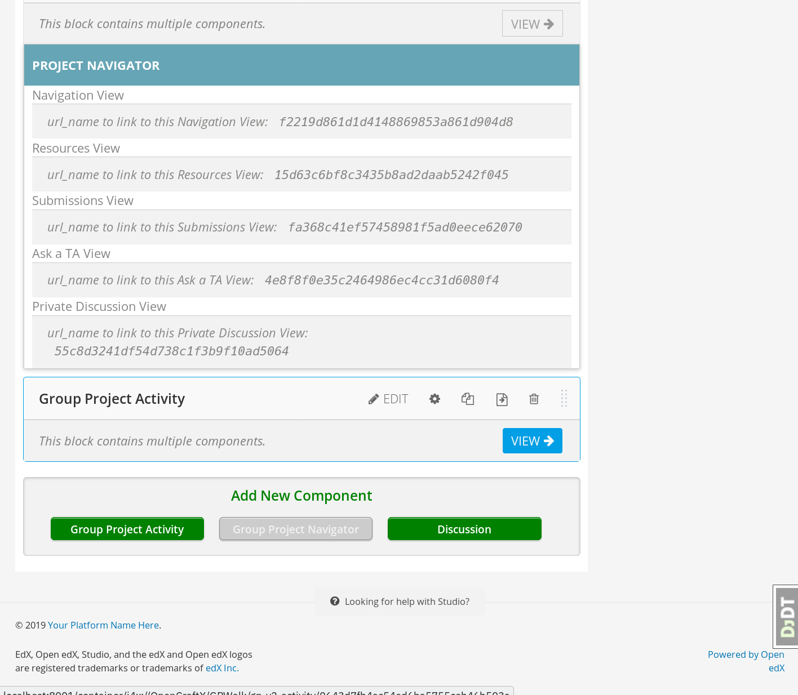

Now select `View->` in the new "Group Project Activity" panel to begin adding content to the activity.  The components
we can add to an activity are called "stages."  We will add four stages to our activity: "Text," "Deliverable," "Peer
Grading," and "Grade Display."  Each one will need further content.

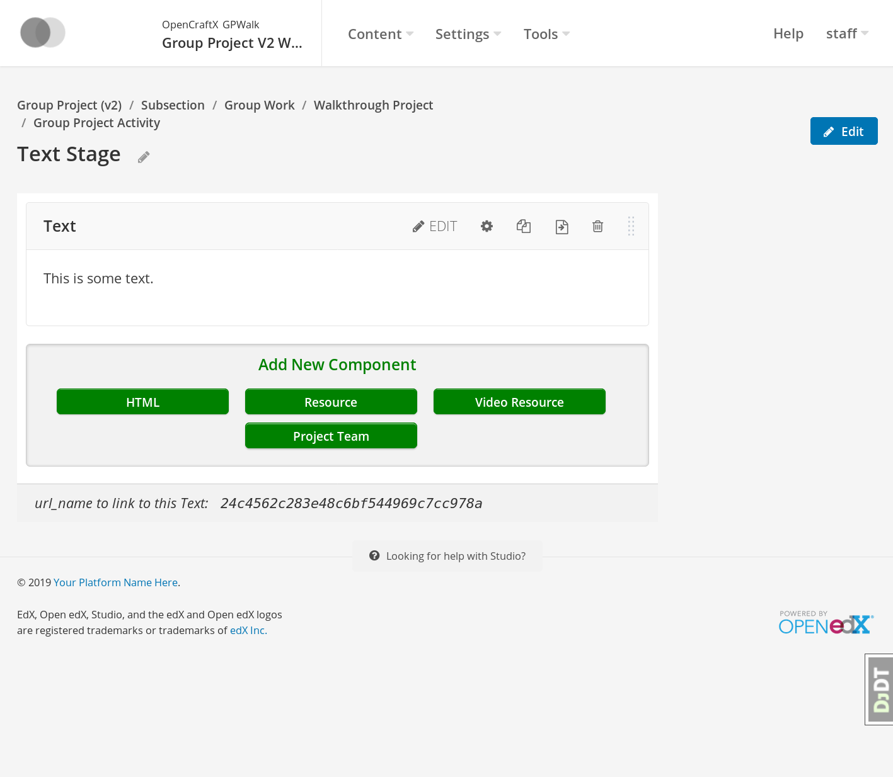

In a "Text" stage, we can add HTML, which will be displayed to our learners, as well as a few other kinds of content
blocks.  For this demo, we'll just add a single HTML snippet, as shown here.

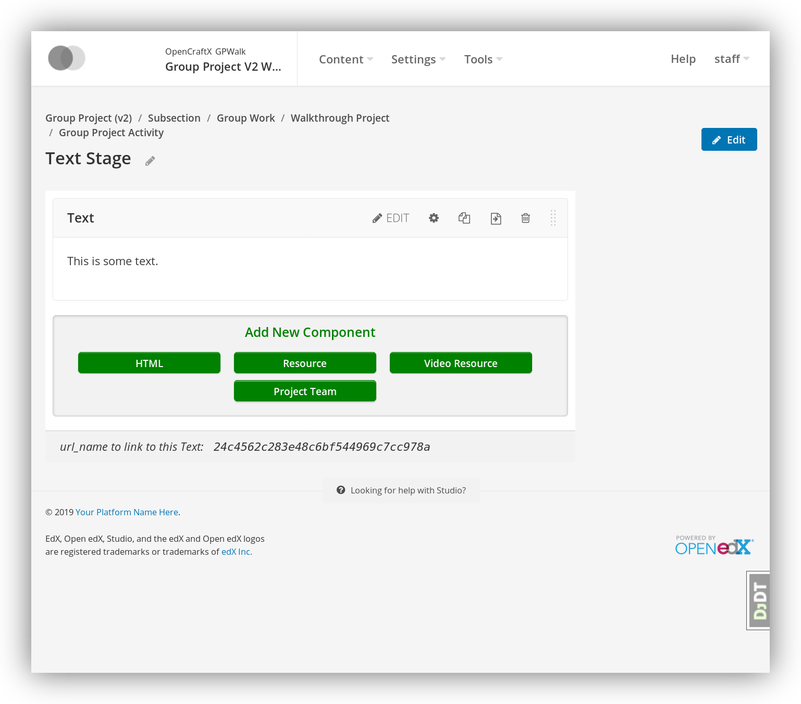

Clicking on "Deliverable" will add a Submission Stage where users can upload files to complete their work.

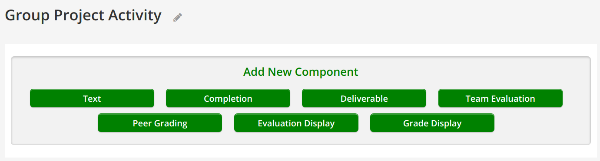

In the Submission Stage, clicking "Submission" will create the submission itself. Make sure to add a "Submissions
Help Text" as well, keeping the default instructions.

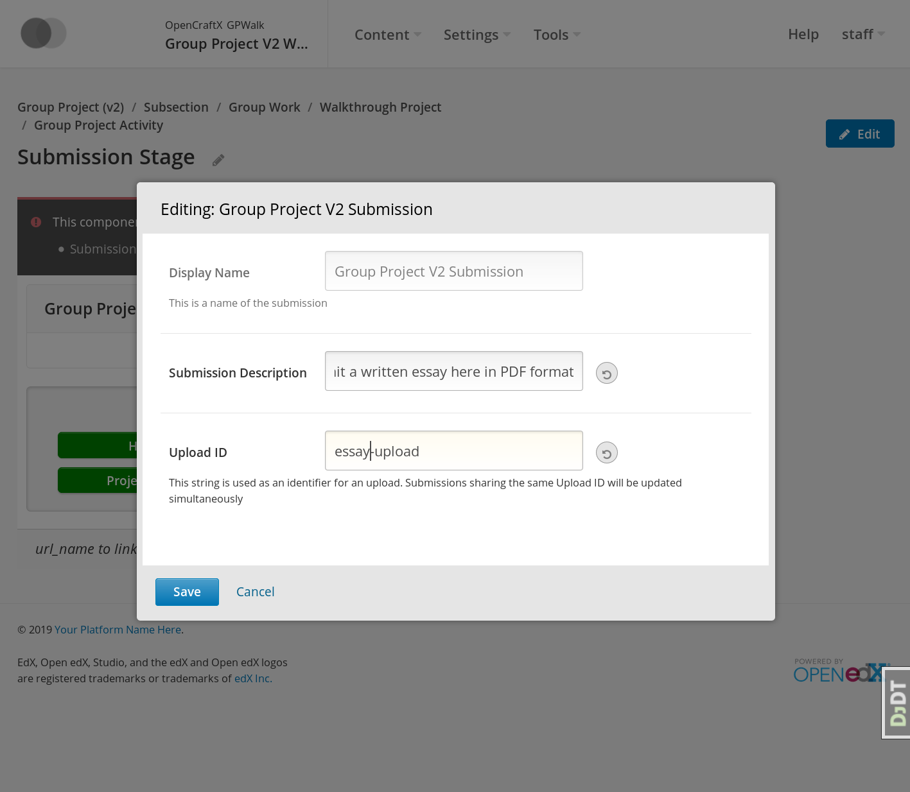

Next we will edit the "Peer Grading Stage."  Again, there are a number of possible components we can add, but we will
just add the two required ones:  There must be at least one "Review Question," and one "Group Selector."  The Group
Selector doesn't require any customization.  Simply adding it is enough.  We will need to click "Edit" on the Review
Question, and add the question in shortest form to "Question Text" and "Assessment Question Text," and in extended
form, with explanatory content in "Question Content."  We will also set "Required" to True and "Graded" to True.

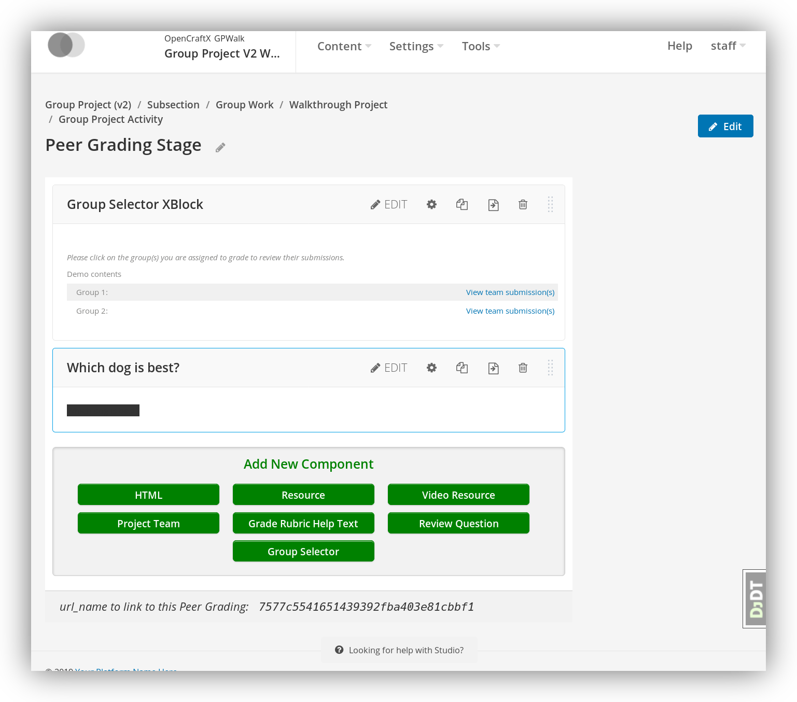

Then we will update the "Grade Display Stage."  Here we provide a page for learners to review their performance on
earlier assessments.  Since we only had one question in our group activity, we will add a single "Review Assessment"
component here.  Once you have added it, select "Edit", and update "Question ID" to point to the question you created
earlier.  If we had more than one question in our Group Project, we could add multiple review components here.

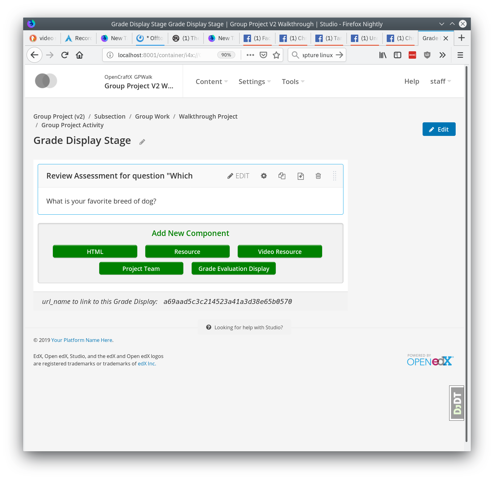

That concludes the creation of our Group Activity.

### Adding a Discussion Component

You may also want to add an area where members of the project groups can communicate with one another.  We can do this
in a "Discussion" component.  Select "Walkthrough Project" from the breadcrumb menu near the top of the page (in
the example project the breadcrumbs show up as "Group Project (v2) / Subsection / Group Work / Walkthrough Project",
followed by other sections depending on where we are in the project.  Scroll down past the Group Project Navigator, and
past the Group Project Activity, and add a new "Discussion" component.

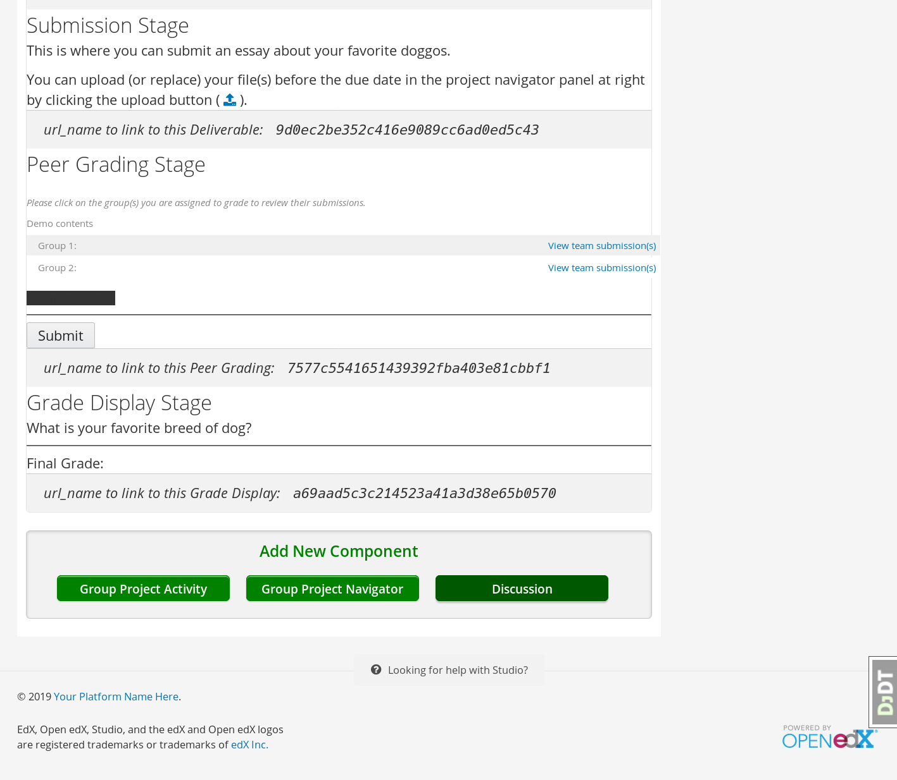

That's all you need to do.  If you like, you can rename the discussion section or add it to a particular category or
subcategory, but this is entirely optional. Click `View ->` again on the Group Project Navigator above, and verify that
there is no longer a Validation error on the Private Discussion View.

Finally, navigate back up to the level above "Walkthrough Project," which we called "Group Work."  Select Publish to
make your Group Project available to your students.

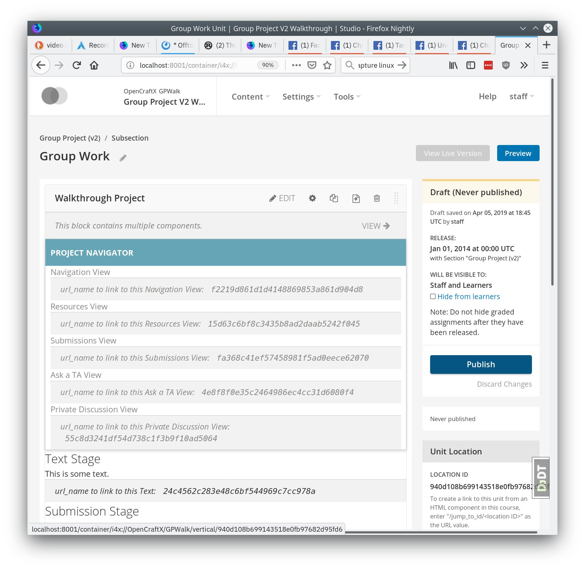

Congratulations!  You've created your first Group Project.

